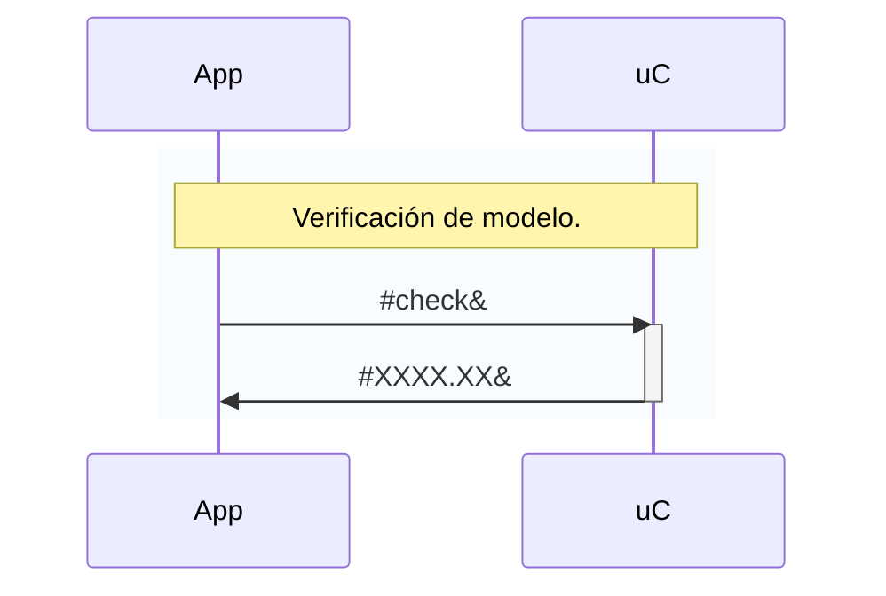
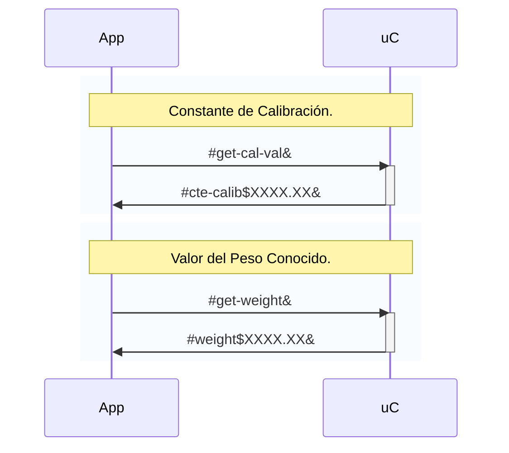
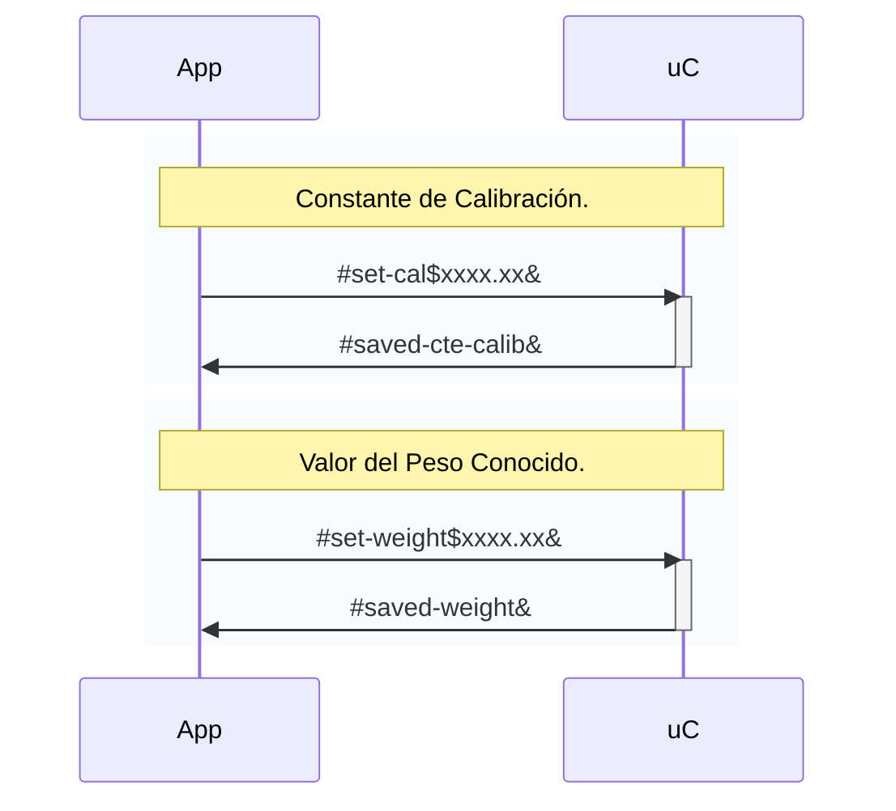
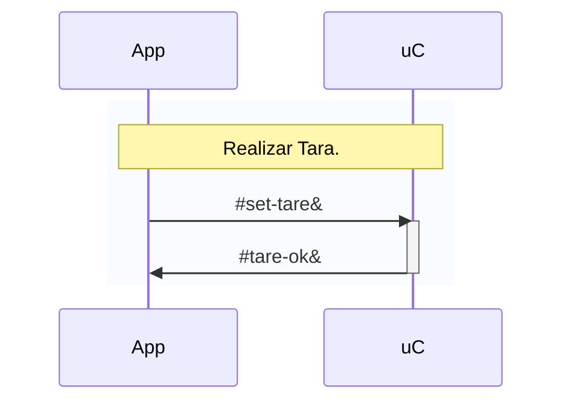
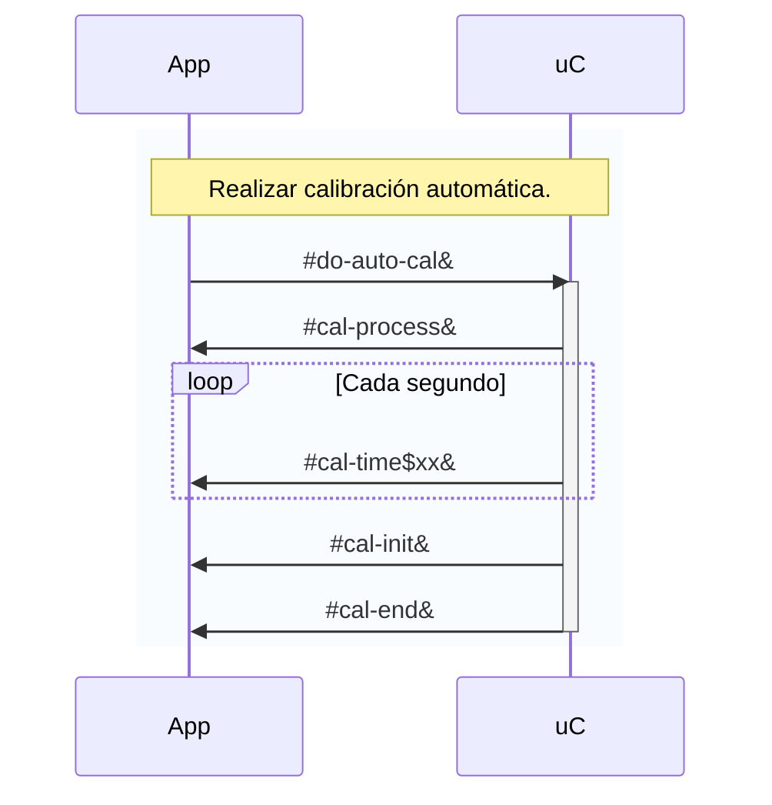
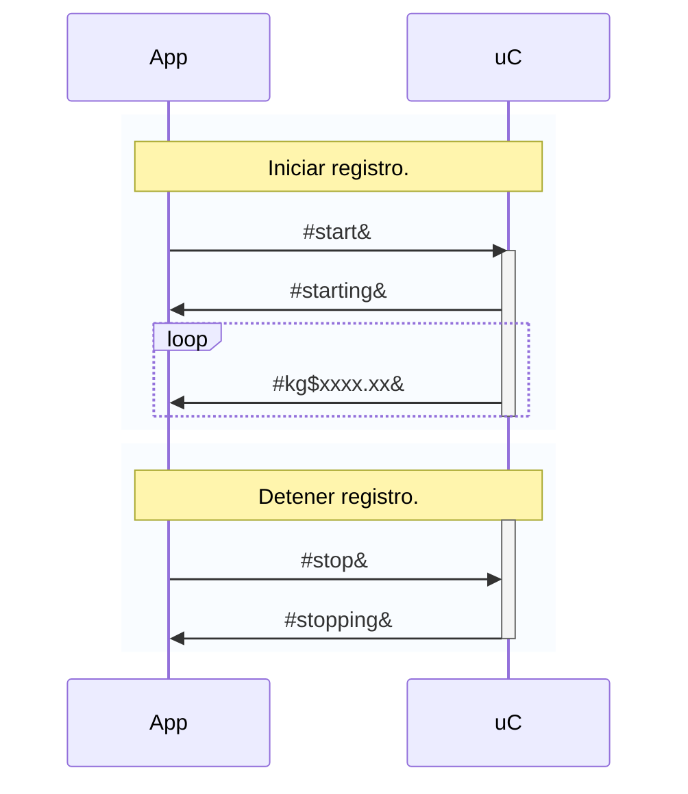

# Comunicación entre la App y el Microcontrolador
Se realiza mediante la comunicación serial. MatLab incorpora el módulo [SerialPort](https://www.mathworks.com/help/matlab/ref/serialport.html) mientras que el Arduino Micro incorpora el protocolo Serial a traves del USB.

Para el envío y recepción de datos se utilizó una estructura especifica:

- Mensajes simples: `#ID_MSG&`
- Mensajes con valor float: `#ID_MSG$XXXX.XX&`

De esta forma, el simple hecho de que existan los caracteres `#` y `&` permite asegurar que el mensaje llego correctamente. Por otra parte, el carácter `$` fuerza la separación entre el *identificador del mensaje* y el *valor float* en cuestión.

Los mensajes que se configuraron son los siguientes:

## Confirmación de Modelo
La verificación del modelo consta asegurar que la versión de la App corresponde a la version usada en el Arduino. La App solicita con el *check* este valor y lo compara con el que tiene configurado internamente.

## Obtención de Parámetros
Los parámetros los solicita la App para luego procesar el valor recibido.

## Configuración de Parámetros
Los valores que se fijen en la app, se envian al uC y alli se almacenarán en la memoria EEPROM.

## Operaciones
### Tara
Permite enviar la orden al uC para que realize la tara haciendo uso de la librería.

### Calibración Automática
La calibración automática permite obtener el valor de la *constante de calibración* utilizando un *peso conocido*. Claramente este valor tiene que estar previamente configurado.

El proceso dura alrededor de 25 segundos de los cuales los primeros 20 son simplemente de espera para que el operario pueda colocar el peso configurado encima de la celda de carga.

La app queda en un bucle esperando todos los mensajes detallados a continuacion. Dado que se espera como máximo 25 segundos, la app usa un timeout para verificar si no se logró obtener el ultimo mensajes `#cal-end&`.

### Inicio y Detención del Registro
Para que la App pueda registrar los valores de forma continua debe enviar un comando para que el uC entre en modo de envío constante (estado *READING* de la maquina de estados).

Para salir de ese estado es necesario enviar otro comando tal como lo indica el siguiente gráfico secuencial.

